<div align="center">


[](https://git.io/typing-svg)

</div>

<br/>

## `whoami`

```swift
struct Developer: Identifiable {
    let id = UUID()
    let name = "Bruno Mello"
    let role = "iOS Developer"
    let location = "Brazil"

    var skills: [String] {
        ["Swift", "SwiftUI", "UIKit", "Combine", "Clean Architecture"]
    }

    var philosophy: String {
        "Code should be elegant, maintainable, and tell a story"
    }

    func buildApp() -> App {
        App(quality: .exceptional, userExperience: .delightful)
    }
}
```

<br/>

## Tech Arsenal

<div align="center">

### Core


### Frameworks


### Tools & Services


### Also Experienced With


</div>

<br/>

## What I Value

<table align="center">
<tr>
<td align="center" width="33%">

<br/><b>Clean Code</b><br/>
<sub>Readable, maintainable, testable</sub>
</td>
<td align="center" width="33%">

<br/><b>Performance</b><br/>
<sub>Smooth 60fps experiences</sub>
</td>
<td align="center" width="33%">

<br/><b>User Experience</b><br/>
<sub>Every pixel matters</sub>
</td>
</tr>
</table>

<br/>

## GitHub Metrics

<div align="center">



</div>

<br/>

## Analytics

<div align="center">


</div>

<br/>

## Activity Graph

<div align="center">

[](https://github.com/BrunoCerberus)

</div>

<br/>

## Let's Connect

<div align="center">

<a href="https://brunocerberus.github.io">
  
</a>
<a href="https://www.linkedin.com/in/bruno-lopes-de-mello/">
  
</a>
<a href="https://x.com/blopesmello">
  
</a>
<a href="mailto:bruno.lopes.mello@icloud.com">
  
</a>

<br/><br/>


**Open to collaborating on interesting iOS projects!**

<br/>

*"First, solve the problem. Then, write the code."* — John Johnson

<br/>


</div>


